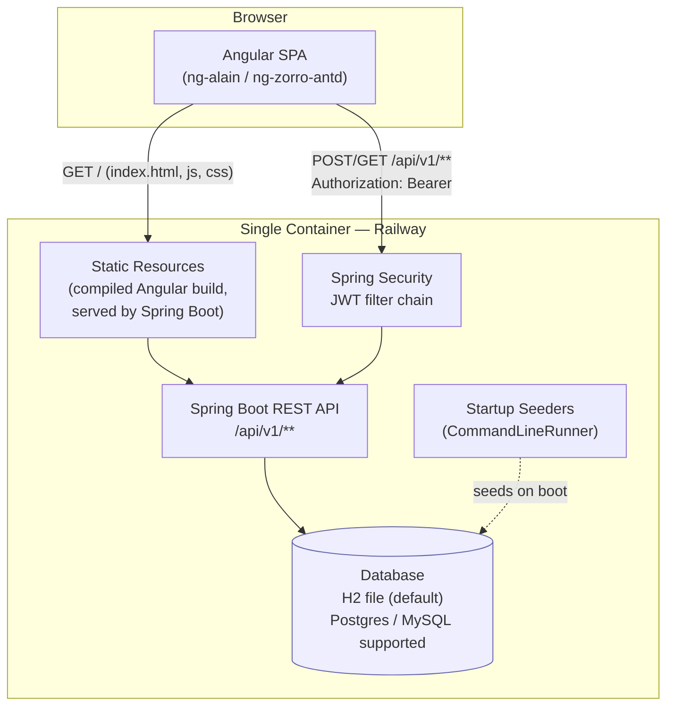
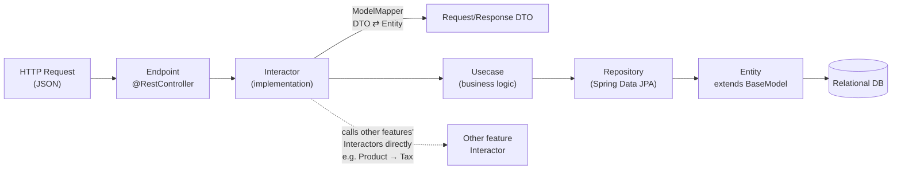
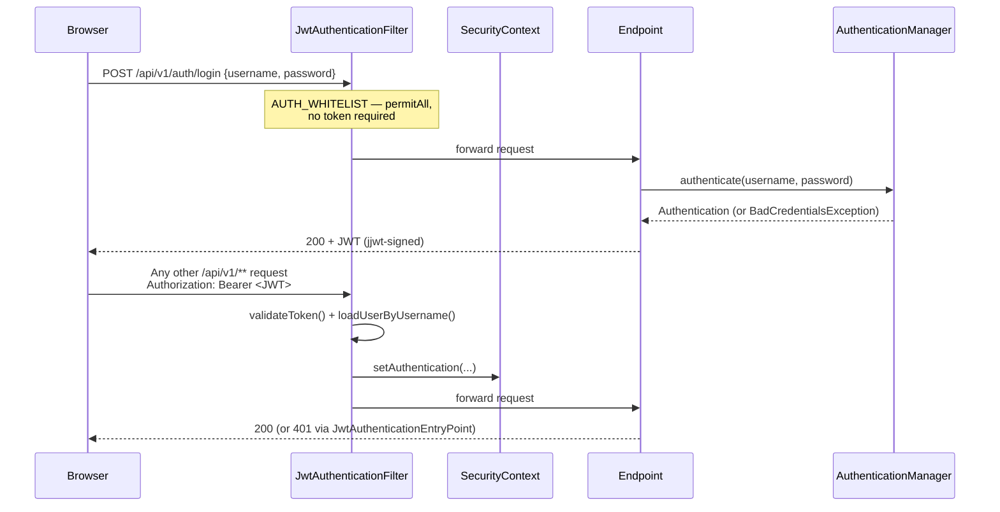

# Stocky — Architecture Overview

Stocky is a full-stack, multi-store **retail / inventory management system** (POS + light ERP):
product catalog, stock/inventory, sales transactions, company & employee/customer management,
reporting, and configurable settings, sitting behind role/permission-based authentication.

It is a **monorepo with two Maven modules** built and shipped as **one deployable artifact**:

| Module | Stack | Role |
|---|---|---|
| `stocky-api` | Java 17, Spring Boot 2.7, Spring Security, Spring Data JPA | REST API, business logic, persistence, auth |
| `stocky-web` | Angular 15, ng-alain / ng-zorro-antd (`@delon/*`) | Admin-panel style SPA UI |

The root `pom.xml` is a Maven **reactor** (`packaging=pom`) that builds `stocky-web` first, then
`stocky-api`; a resource-copy step embeds the compiled Angular app into `stocky-api`'s Spring Boot
jar as static resources. The `Dockerfile` does this in a multi-stage build (Maven+JDK11 build
stage → JRE11 runtime stage), so the shipped container is a **single Spring Boot process that
serves both the UI and the API from one origin**. This is currently deployed to Railway.

---

## 1. High-Level Architecture (HLD)



**Request flow in one sentence:** the browser loads the Angular app as static files from the
Spring Boot server, then that same-origin SPA calls `/api/v1/...` JSON endpoints, each protected
by a JWT filter chain, backed by a relational database seeded with default roles/permissions/admin
user on first boot.

---

## 2. Backend — Clean-Architecture Layering (per feature) — Low-Level Diagram (LLD)

Every backend feature (`authentication`, `company`, `product`, `stock`, `sale`, `report`,
`settings`, `paywall`) follows the same layered package structure:

```
features/<feature>/
├── endpoint/            → @RestController — HTTP in/out only
├── data/
│   ├── request/         → DTOs (+ mappers, JPA Specifications for search/filter)
│   ├── interactor/
│   │   ├── contract/    → interactor interfaces
│   │   └── implementation/ → DTO ⇄ Entity mapping (ModelMapper), orchestrates usecases
│   ├── repository/      → Spring Data JPA repositories
│   └── usecase_impl/    → business-logic implementations
└── domain/
    ├── entity/          → JPA entities (extend core.base.BaseModel for audit columns)
    ├── enums/
    └── usecase/         → business-logic interfaces
```



This mirrors what actually happens in code, e.g. `ProductEndpoint` → `ProductInteractor`
(implements `IProductInteractor`, maps `ProductRequest` ⇄ `Product` via `ModelMapper`) →
`IProductUsecase` → `ProductRepository` → `Product` entity. Interactors also call sibling
interactors directly for composite saves (e.g. `ProductBasicInteractor` pulls in
`IProductTaxInteractor` to resolve nested tax lines before persisting).

### 2.1 Security / JWT flow



Roles carry a `Set<Permission>` (`Role` ↔ `Permission`, `User` ↔ `Role`), seeded once at startup
by `Runner` (a `CommandLineRunner`) in this order: `SettingSeeder → CompanySeeder →
PermissionSeeder → UserSeeder`. `UserSeeder` creates exactly one system/admin login, from the
`STOCKY_SYSTEM_USERNAME` / `STOCKY_SYSTEM_PASSWORD` environment variables (production) — there is
no public self-registration endpoint.

---

## 3. Frontend structure

`stocky-web/src/app/routes/` mirrors the backend feature set — each is a lazily-loaded Angular
module: `passport` (login), `dashboard`, `company`, `products`, `stock`, `sales`, `report`,
`settings`, `paywall`, `user`. Built on the **ng-alain** admin framework (`@delon/theme`,
`@delon/auth`, `@delon/acl`, `@delon/form`, `@delon/abc`, `@delon/mock`, `@delon/chart`) on top of
`ng-zorro-antd`. `environment.prod.ts` points the API base URL at the relative path `/api/v1`,
which resolves to the same origin the SPA was served from — because, per §1, both are the same
container in production.

---

## 4. Key cross-cutting pieces

- **Auth**: stateless JWT (`jjwt`), `BCryptPasswordEncoder`, custom `JwtAuthenticationFilter` +
  `JwtAuthenticationEntryPoint`, method-level security enabled
  (`@PreAuthorize`/`@Secured`/`@RolesAllowed`).
- **Persistence**: H2 file DB by default (`application-prod.properties`,
  `application-dev.properties`); Postgres and MySQL drivers are also on the classpath
  (`application-cks.properties` targets MySQL), so the DB is swappable per environment/profile.
- **Reporting**: JasperReports dependency backs the `report` feature (sales reports).
  Bulk product import via Apache POI (`poi-ooxml`).
- **Seeding**: idempotent startup seeders guarantee a baseline of permissions, one default role,
  one admin user, and default settings exist on every fresh boot.
- **CORS**: configured in `configuration/configurer/CorsConfiguration.java` via
  `app.cors.allowed-origins` (env-overridable per profile) — this must include whatever origin the
  browser actually loads the app from, since Spring's CORS check rejects any request carrying a
  non-whitelisted `Origin` header with `403`, regardless of whether it's technically same-origin.
- **Deployment**: single Docker image (Maven build stage → JRE runtime stage) on Railway; profile
  activation via the `SPRING_PROFILES_ACTIVE` environment variable.
